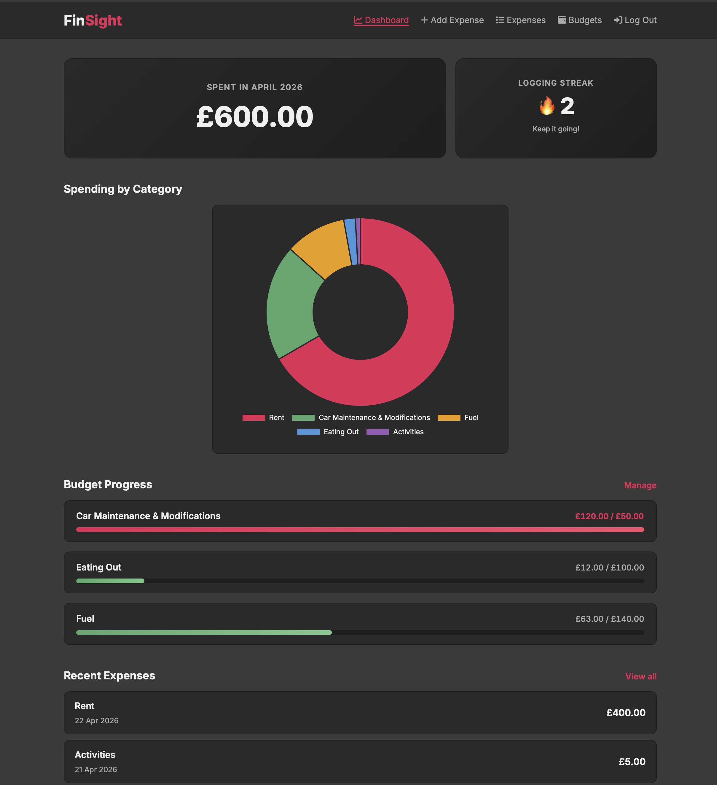

# FinSight
 
A full-stack budgeting web app designed for students. Track expenses, set monthly budgets, visualise spending, and build a logging streak — all in one place.
 

 
**Live demo:** https://finsight-pe5l.onrender.com
 
---
 
## About
 
FinSight is the final year computing project of Yasin Ahmed at Goldsmiths, University of London (Unit Code: IS53080A), supervised by Roja Ahmadishirvani.
 
The application is a responsive web app built with Node.js, Express, and MySQL on the backend, and vanilla HTML, CSS, and JavaScript on the frontend. It follows a three-tier architecture, uses session-based authentication, and is deployed on Render with a managed MySQL database hosted on Aiven.
 
## Features
 
- **Secure authentication** — Account registration and login with bcrypt password hashing and server-side sessions
- **Expense management** — Add, view, and delete expenses, organised by category and date
- **Budget tracking** — Set monthly spending limits per category, with automatic upsert behaviour when re-saving an existing budget
- **Dashboard** — Single-page overview showing this month's total spent, an interactive doughnut chart of spending by category, budget progress bars, and recent expenses
- **Visual overspending indicators** — Budget bars and amount labels turn red when spending exceeds the set limit
- **Logging streak** — Gamified streak counter that rewards consecutive days of active expense logging (uses true engagement timestamps, not user-provided dates)
- **Responsive design** — Fully usable on desktop and mobile, including a hamburger menu for narrow screens
- **Frontend and backend input validation** — Protects against invalid input from both honest users and direct API access
## Quick Start (Live Demo)
 
The fastest way to use FinSight is to visit the live deployment:
 
**https://finsight-pe5l.onrender.com**
 
1. Click **Get Started** on the landing page to create an account, or **Log In** if you already have one.
2. Add a few expenses from the **Add Expense** page.
3. Set a budget on the **Budgets** page.
4. Visit the **Dashboard** to see your spending summary, category breakdown, and budget progress.
No test credentials are needed — registration is free and instant.
 
> **Note on cold starts:** Both the web service (Render) and the database (Aiven) run on free hosting tiers. After prolonged inactivity, services may temporarily power down. The first request after a long pause can take 30–60 seconds while services resume. If the site doesn't load on the first try, please wait a moment and refresh. See **Known Limitations** below for more detail.
 
## Local Installation
 
To run FinSight on your own machine, you will need:
 
- **Node.js** version 18 or higher
- **MySQL** version 8 or higher (running locally, or accessible remotely)
- **Git**
### 1. Clone the repository
 
```bash
git clone https://github.com/yxs1n/FinSight.git
cd FinSight
```
 
### 2. Install dependencies
 
```bash
npm install
```
 
### 3. Set up the database
 
Start your MySQL server, then run the schema file to create the database, tables, and seed the categories:
 
```bash
mysql -u <your-mysql-user> -p < database/schema.sql
```
 
Replace `<your-mysql-user>` with your local MySQL username (often `root`). You will be prompted for the password.
 
This creates a database called `finsight_db` with four tables (`users`, `categories`, `expenses`, `budgets`) and inserts 11 default expense categories.
 
### 4. Create a `.env` file
 
In the project root, create a file called `.env` with the following contents:
 
```
DB_HOST=localhost
DB_PORT=3306
DB_USER=<your-mysql-user>
DB_PASSWORD=<your-mysql-password>
DB_NAME=finsight_db
SESSION_SECRET=any-long-random-string-for-local-dev
```
 
`SESSION_SECRET` only needs to be a unique random string for local use.
 
### 5. Run the server
 
```bash
npm start
```
 
You should see:
 
```
Database connection successful
Server is running on port 3000
```
 
Open your browser to `http://localhost:3000` and FinSight will be running locally.
 
## Project Structure
 
```
FinSight/
├── server.js                 — Express app entry point
├── config/
│   └── db.js                 — MySQL connection pool
├── middleware/
│   └── auth.js               — Authentication middleware
├── routes/
│   ├── auth.js               — Register, login, logout endpoints
│   ├── expenses.js           — Expense CRUD endpoints
│   ├── budgets.js            — Budget CRUD endpoints (with upsert)
│   ├── dashboard.js          — Aggregated dashboard data endpoint
│   └── streak.js             — Logging streak calculation endpoint
├── database/
│   ├── schema.sql            — Local development schema
│   └── schema.production.sql — Schema for managed MySQL hosts
└── public/
    ├── index.html            — Single-page application shell
    ├── css/style.css         — All styling
    └── js/
        ├── main.js           — Navigation, view switching, auth state
        ├── auth.js           — Register and login form handling
        ├── expenses.js       — Expense form, list, and delete logic
        ├── budgets.js        — Budget form, list, and delete logic
        └── dashboard.js      — Dashboard rendering, including Chart.js
```
 
## Tech Stack
 
- **Backend:** Node.js, Express 5, mysql2, bcrypt, express-session, dotenv
- **Frontend:** Vanilla HTML/CSS/JavaScript (no framework), Chart.js 4, Font Awesome 6, Inter font
- **Database:** MySQL 8
- **Hosting:** Render (web service), Aiven (managed MySQL)
## Known Limitations
 
These are limitations the marker should be aware of:
 
- **Free-tier cold starts.** As mentioned above, both Render and Aiven free tiers may pause inactive services. First-request load times can be 30–60 seconds after a pause. This is a deployment-tier limitation, not a code issue.
- **Aiven service auto-power-off.** Aiven's free MySQL tier may power off the service entirely after extended inactivity. If the live URL returns a database error, the database may need to be manually resumed. In that case, please contact me or try again later.
- **In-memory session store.** Express's default `MemoryStore` is used for sessions. This is suitable for a single-instance deployment but does not persist sessions across server restarts. A production system at scale would use a dedicated session store (e.g. Redis or a MySQL-backed store).
- **No browser back/forward navigation in the SPA.** The application uses client-side view switching without integrating with the History API. The browser back button does not navigate between views. Users navigate via the in-app navigation links instead.
- **No expense editing.** Expenses can be added or deleted but not edited in place. To correct a mistake, the user deletes the expense and re-adds it.
- **All-time data retention.** There is no archive or year-rollover behaviour; all expenses and budgets remain visible indefinitely.
## Author
 
Yasin Ahmed — Goldsmiths, University of London  
Final Project in Computing (IS53080A)  
Supervisor: Roja Ahmadishirvani